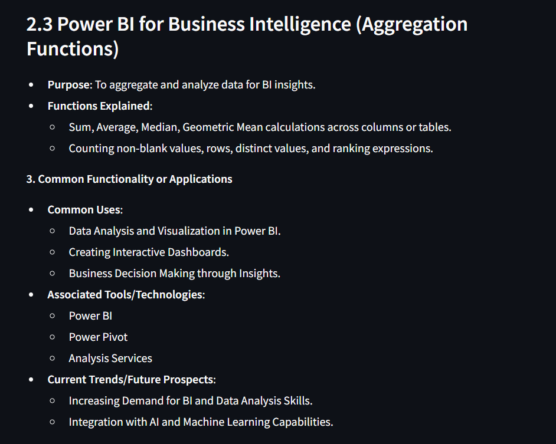
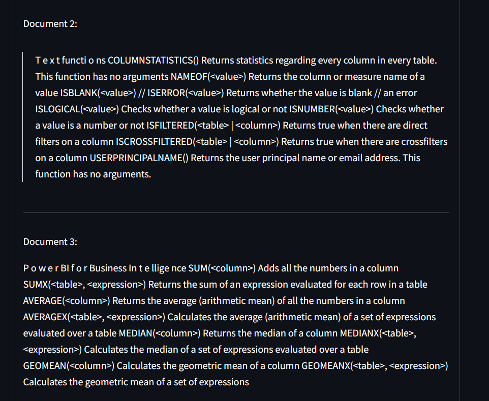

# 📚 RAG Applications with NVIDIA NeMo and Streamlit 
[](https://www.python.org/downloads/)
[](https://streamlit.io/)
[](https://www.nvidia.com/en-us/ai-data-science/)
[](LICENSE)

<p align="center">
  
</p>

## 🌟 Overview

A sophisticated implementation of Retrieval Augmented Generation (RAG) leveraging NVIDIA's AI endpoints and Streamlit. This application transforms document analysis and question-answering through state-of-the-art language models and efficient vector search capabilities.

### 🎯 Core Features
- 📄 Multi-PDF Document Processing
- 🔍 Advanced Text Chunking System
- 💾 FAISS Vector Store Integration
- ⚡ NVIDIA NIM Endpoints
- 🤖 Nvidia llama-3.1-nemotron-70b Model Support
- ⏱️ Real-time Performance Metrics
- 📊 Similarity Search Visualization


## 🛠️ Technical Architecture

### Component Stack


### System Requirements
- Python 3.8+
- 8GB RAM minimum
- NVIDIA API access
- Internet connectivity
- PDF processing capabilities

## 📦 Installation & Setup

### 1. Clone Repository
```bash
git clone https://github.com/vikasjangidmk/RAG1-NVIDIA-GENAI.git
cd RAG1-NVIDIA-GENAI
```

### 2. Environment Setup
```bash
# Create virtual environment
conda create -p genai python==3.11

# Activate environment
# For Windows
conda activate genai/

# Install dependencies
pip install -r requirements.txt
```

### 3. Configuration
```bash
# Create environment file
touch .env

# Add required credentials
NVIDIA_API_KEY=your_api_key_here
```


## 💻 Usage Guide

### Application Launch
```bash
streamlit run app.py
```

### Document Processing Workflow

1. **Document Upload**
   - Support for multiple PDF files
   - Automatic text extraction
   - Progress tracking
   

2. **Embedding Creation**
   - Click "Create Document Embeddings"
   - Automatic chunking and processing
   - Vector store initialization
   

3. **Query Processing**
   - Enter questions about documents
   - Real-time response generation
   - View similarity search results
   
   <p align="center">
    
  </p>
  <p align="center">
  
</p>
<p align="center">
  
</p>
<p align="center">
  
</p>
<p align="center">
  
</p>
<p align="center">
  
</p>
## ⚙️ Configuration Options

### Text Splitting Parameters
```python
text_splitter = RecursiveCharacterTextSplitter(
    chunk_size=700,  # Adjust for document length
    chunk_overlap=50  # Modify for context preservation
)
```

### Model Configuration
```python
llm = ChatNVIDIA(
    model="nvidia/llama-3.1-nemotron-70b-instruct",
    temperature=0.7,  # Adjust for response creativity
    max_tokens=512    # Modify for response length
)
```

## 📈 Performance Optimization

### Vector Store Tuning
- Optimal chunk size selection
- Embedding dimension management
- Index optimization techniques

### Response Time Improvements
- Query preprocessing
- Cache implementation
- Batch processing capabilities


## 🔍 Advanced Features

### 1. Intelligent Chunking
- Content-aware text splitting
- Semantic boundary preservation
- Overlap optimization

### 2. Vector Search Enhancement
- Nearest neighbor search
- Similarity threshold tuning
- Result ranking optimization

### 3. Response Generation
- Context-aware answers
- Source attribution
- Confidence scoring

## 🚀 Best Practices

### Document Preparation
- Use clear, well-formatted PDFs
- Ensure text is extractable
- Optimize document size

### Query Formulation
- Be specific and clear
- Include relevant context
- Use natural language

### System Optimization
- Monitor memory usage
- Regular cache clearing
- Performance tracking

## 🛠️ Troubleshooting

### Common Issues
1. **PDF Processing Errors**
   - Solution: Check PDF format compatibility
   - Verify text extraction capabilities

2. **Memory Issues**
   - Solution: Adjust chunk size
   - Implement batch processing

3. **API Connection**
   - Solution: Verify credentials
   - Check network connectivity

## 🤝 Contributing

### Development Workflow
1. Fork repository
2. Create feature branch
```bash
git checkout -b feature/YourFeature
```
3. Commit changes
```bash
git commit -m 'Add YourFeature'
```
4. Push to branch
```bash
git push origin feature/YourFeature
```
5. Submit Pull Request


## 📝 License

This project is licensed under the MIT License. See [LICENSE](LICENSE) for details.

## 🙏 Acknowledgments

- NVIDIA AI Team
- Streamlit Community
- LangChain Contributors
- Meta AI Research

## 📞 Support & Contact

- Create an Issue
- Join Discussions
- Review Documentation


---


*Made with ❤️ by [@vikasjangidmk](https://github.com/vikasjangidmk)*

</div>